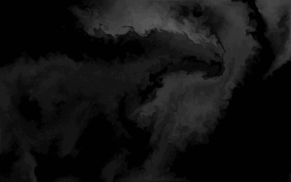

# The background animation

The dark, drifting smoke behind every screen is a **real fluid simulation** running on
the GPU — Stam's *Stable Fluids* solved in fragment shaders, rendered in grayscale and
put through an 8×8 Bayer dither. The pointer does not fake a highlight over it; it
injects momentum into a velocity field, and the smoke is carried by that field.



*8 s, 10 fps, 600×375. The pointer sweeps left→right, back right→left, then flicks and
stops. Watch the wake keep curling after the pointer has gone, and the field settle back
to its resting texture. [How this was recorded](#reproducing-the-gif).*

---

## Contents

- [Why it works this way](#why-it-works-this-way)
- [Files](#files)
- [Three-way capability gating](#three-way-capability-gating)
- [The physics](#the-physics)
- [The passes, in order](#the-passes-in-order)
- [Rendering: dither, quantization, colour](#rendering-dither-quantization-colour)
- [The measured palette](#the-measured-palette)
- [Interaction](#interaction)
- [Ambient motion](#ambient-motion)
- [The smoke source](#the-smoke-source)
- [Configuration reference](#configuration-reference)
- [Performance](#performance)
- [Accessibility](#accessibility)
- [The fallback shader](#the-fallback-shader)
- [Gotchas](#gotchas)
- [Reproducing the GIF](#reproducing-the-gif)

---

## Why it works this way

The original background (`Dither.jsx`) drew a scrolling FBM noise field and pushed a
`smoothstep` dent into it under the cursor. That reads as a **spotlight, not as smoke**:
the dent has no memory, so the instant the pointer moves on, the surface is exactly as it
was. Nothing is left behind.

The current background replaces the dent with **momentum**. The pointer's velocity is
splatted into a velocity field; everything after that is the field's own business. Swirls
persist, wakes trail, eddies keep turning long after the pointer has gone, and the whole
thing relaxes back to its resting texture on its own.

The *look* was deliberately kept identical — same grayscale, same Bayer dither, same
quantization, same noise grain. **The physics is new; the appearance is not.**

## Files

| File | Role |
|---|---|
| `Background.tsx` | Probes for float render targets, picks the simulation or the fallback, and owns the fixed full-viewport layer |
| `Fluid.tsx` | The whole simulation: 11 GLSL passes, the solver class, the React binding, the config |
| `Dither.jsx` | The pre-simulation shader, still shipped as the no-float-targets fallback |
| `Dither.css` | Five lines: `.dither-container { width/height: 100%; position: relative }` — used by both |
| `Galaxy.jsx`, `Galaxy.css` | **Unused.** Not imported anywhere; kept from an earlier iteration |

Stack: `three ^0.180.0`, `@react-three/fiber ^9.3.0`, WebGL2 / GLSL ES 3.0.

The layer itself is deliberately inert:

```tsx
position: fixed; inset: 0; width: 100vw; height: 100vh;
zIndex: -1; pointerEvents: "none";
```

`z-index: -1` puts it behind everything, and `pointer-events: none` means it can never
intercept a click. That last one has a consequence — see [Interaction](#interaction).

## Three-way capability gating

Three different things can end up on screen, decided in two places:

1. **No WebGL at all, or a software renderer** → no animation. `src/app/page.tsx` probes
   `WEBGL_debug_renderer_info` and, on `swiftshader|software|llvmpipe`, drops to a static
   CSS gradient (`radial-gradient(ellipse at top, #0b1224, #050810 65%)`) so white text
   stays readable.
2. **WebGL2 without `EXT_color_buffer_float`** → `Dither`. The simulation keeps velocity,
   pressure and dye in **half-float** targets; velocity is signed and routinely exceeds 1,
   which an 8-bit target cannot hold. Rather than render nothing, the old wave shader runs.
3. **Everything present** → `Fluid`.

```tsx
const [fluid, setFluid] = useState<boolean | null>(null);
useEffect(() => setFluid(supportsFloatTargets()), []);
// null until probed, so the server and the first client render agree
```

The `null` state matters: probing requires a real canvas, so it cannot happen during SSR,
and rendering *anything* before the probe would produce a hydration mismatch.

## The physics

Stam's **Stable Fluids** — incompressible Navier–Stokes without the viscosity term,
solved on a uniform grid, every stage a full-screen pass over ping-pong half-float
targets:

```
                  ┌──────────────── velocity field ────────────────┐
  pointer splat ─→│                                                │
  ambient curl ─→ │ forces → vorticity → divergence → pressure ×20 │
                  │            ↓ (curl)      ↓                     │
                  │        gradient subtract ┘                     │
                  │            ↓                                   │
                  │        advect velocity ──→ advect dye ─────────┼─→ dye field
                  └────────────────────────────────────────────────┘
                                                    + FBM source ──┘
                                                          ↓
                                             display (tint → dither → quantize)
```

**Semi-Lagrangian advection is unconditionally stable.** A dropped frame, a long GC pause
or a backgrounded tab can never blow the simulation up — the worst case is a smeared
field, and even that is guarded (`dt` is clamped to `1/30`).

### Units: screen heights per second

Velocity is stored in **screen heights per second**, for *both* components. UV space is
anisotropic on a non-square canvas (`uv.x` spans `aspect` height-units), so working in
height-units is what keeps a diagonal flick diagonal. Two rules follow, and they are the
only places `aspect` appears in the shaders:

```glsl
// uv offset from a velocity
duv = v * dt * vec2(1.0 / uAspect, 1.0);
// height-units from a uv delta
p.x *= uAspect;
```

The **simulation grid is allocated at the canvas aspect ratio**, so its cells are square
and the finite differences need no correction of their own:

```ts
const simH = max(32, simResolution);          // 160
const simW = max(32, round(simH * aspect));   // 256 at 16:10
```

### Boundary conditions

Two different treatments, and they are not interchangeable:

- **Divergence** (`DIVERGENCE`) reflects: outside the edge, `L = -C.x` etc. This states
  that nothing flows *through* the wall, which is what the pressure solve needs as its
  right-hand side.
- **Gradient subtract** (`GRADIENT`) applies **free-slip** walls: the normal component is
  zeroed on the boundary row/column, the tangential component is untouched. Smoke slides
  along the edge of the screen rather than sticking to it.

## The passes, in order

Eleven shader programs, `GLSL3`, all sharing one full-screen quad (`PlaneGeometry(2,2)`,
`frustumCulled = false`) and a trivial vertex shader that passes `uv` through and writes
`gl_Position = vec4(position.xy, 0, 1)`.

### 1. `AMBIENT` — drift when nobody is touching it

```glsl
vec2 p = vec2(vUv.x * uAspect, vUv.y) * uScale + vec2(0.0, uTime * 0.02);
const float e = 0.05;
vec2 w = vec2(nT - nB, -(nR - nL)) / (2.0 * e);   // curl of a noise potential
vec2 vel = texture(uVelocity, vUv).xy + w * uForce * uDt;
```

The forcing is the **curl of a scrolling Perlin potential**, which is divergence-free *by
construction*. This is the whole trick: the pressure solve downstream has nothing to
remove, so the motion survives projection intact instead of being fought every frame.
A naive random force would be largely deleted by the projection.

### 2. `CURL` — `dv/dx − du/dy`

One scalar per cell, feeding the next pass.

### 3. `VORTICITY` — vorticity confinement

A coarse grid bleeds angular momentum on every advection step, so eddies flatten out
within a second or two. This pushes energy back into whatever rotation survived, along
`N × ω`:

```glsl
vec2 force = 0.5 * vec2(abs(T) - abs(B), abs(R) - abs(L));
force /= length(force) + 1e-4;      // normalize, guarded against 0/0
force *= uCurlStrength * C;
force.y *= -1.0;
vel = clamp(vel + force * uDt, -8.0, 8.0);
```

**This is what makes a wake curl rather than merely spread.** The `clamp(±8)` is a
safety rail: 8 screen-heights per second is already absurd, and without it a pathological
frame could produce an advection step that samples halfway across the buffer.

### 4. `DIVERGENCE` — how much each cell is compressing

The right-hand side of the pressure Poisson equation.

### 5. `CLEAR` — bleed the pressure field

`pressure *= 0.8` before iterating. Keeps the Jacobi solve **warm** — it starts from last
frame's answer, which is nearly right — without letting a stale field drift.

### 6. `PRESSURE` ×20 — Jacobi relaxation

```glsl
fragColor = vec4((L + R + B + T - divergence) * 0.25, 0.0, 0.0, 1.0);
```

Twenty iterations, twenty ping-pong swaps. This is **two thirds of the frame's passes**
and the first thing to cut if the simulation ever needs to be cheaper.

### 7. `GRADIENT` — subtract the pressure gradient

What actually makes the field incompressible: it removes exactly the part of the motion
that was piling fluid up. The `0.5` here **must** match the `0.5` in `DIVERGENCE` — the
two have to use the same finite difference or the projection under- or over-corrects.

### 8–9. `ADVECT` ×2 — transport velocity, then dye

```glsl
vec2 coord = vUv - uDt * vel * vec2(1.0 / uAspect, 1.0);
fragColor = texture(uSource, coord) / (1.0 + uDissipation * uDt);
```

Trace backwards along the field and read what was there; bilinear filtering does the
interpolation for free. The divisor is the dissipation: velocity `0.25`, dye `0.7`, so
dye decays to `e^-0.7 ≈ 50%` of its value per second and velocity to `e^-0.25 ≈ 78%`.

### 10. `SOURCE` — replenish the smoke

Dye dissipates, so without replenishment the screen fades to black within seconds. See
[The smoke source](#the-smoke-source).

### 11. `DISPLAY` — the only pass that reaches the screen

See [Rendering](#rendering-dither-quantization-colour).

`SPLAT` is the twelfth program, run on demand rather than every frame.

## Rendering: dither, quantization, colour

The dye field is a single scalar. The display pass turns it into pixels in four steps:

```glsl
vec2 blockCoord = floor(gl_FragCoord.xy / uPixelSize) * uPixelSize;
float f = texture(uDye, blockCoord / uResolution).x;

vec3 col = mix(vec3(0.0), uColor, f);                       // 1. tint

ivec2 bc = ivec2(mod(floor(gl_FragCoord.xy / uPixelSize), 8.0));
float threshold = bayerMatrix8x8[bc.y * 8 + bc.x] - 0.25;
float stepv = 1.0 / (uColorNum - 1.0);
col += threshold * stepv;                                   // 2. dither

col = clamp(col - 0.2, 0.0, 1.0);                           // 3. black floor
col = floor(col * (uColorNum - 1.0) + 0.5) / (uColorNum - 1.0);  // 4. quantize
```

1. **Tint** — `mix(black, uColor, f)` with `uColor = (0.34, 0.34, 0.34)`. Pure grayscale;
   there is no colour anywhere in this effect. `f` is dye *density* and is not bounded by
   1 — bright wisps measure around `f ≈ 2`.
2. **Dither** — an 8×8 **ordered (Bayer)** matrix, values `0/64 … 63/64`, offset by
   `−0.25` so the perturbation straddles zero, then scaled by one quantization step
   (`1/19 ≈ 0.053`). Net effect: each pixel is nudged by between `−0.013` and `+0.039`
   before quantizing, which converts banding into a stable, non-flickering grain. It is
   **ordered**, not error-diffused, precisely so it does not crawl between frames.
3. **Black floor** — a flat `−0.2`. This is why the background is so dark: with
   `uColor = 0.34`, dye density must exceed `0.2 / 0.34 ≈ 0.59` before a pixel is
   anything but black. Everything below that threshold is crushed, which is what keeps
   the UI readable on top.
4. **Quantize** — snap to `uColorNum = 20` levels. The dither in step 2 is what makes
   this read as texture instead of contour lines.

`uPixelSize` is `1`, so the "pixelate" step reduces to a half-pixel shift in buffer space
(`gl_FragCoord` sits at pixel centres, `floor` snaps it to the corner) — but the canvas
runs at `dpr 0.5`, so one buffer pixel is two CSS pixels. **The dither cell is 2 CSS px
wide, and the browser's upscale then softens it.** That last part is measurable:

## The measured palette

Sampled from a live frame (1200×750 viewport), counting distinct values:

**At the drawing buffer's own scale** (600×375 — what the shader actually wrote):

| Level | Value | Hex | Share of frame |
|---|---|---|---|
| 0 | 0 | `#000000` | 29.21% |
| 1 | 13 | `#0d0d0d` | 24.69% |
| 2 | 27 | `#1b1b1b` | 19.15% |
| 3 | 40 | `#282828` | 12.52% |
| 4 | 54 | `#363636` | 7.41% |
| 5 | 67 | `#434343` | 4.09% |
| 6 | 81 | `#515151` | 1.79% |
| 7 | 94 | `#5e5e5e` | 0.82% |
| 8 | 107 | `#6b6b6b` | 0.30% |
| 9 | 121 | `#797979` | 0.02% |

Exactly **10 distinct values, 100% pure grey**, spaced `13–14` apart — that is
`255/19 = 13.42`, the quantizer's step, confirming `colorNum = 20` end to end. This frame
reaches only the **bottom half of the twenty-rung ladder**: the `−0.2` floor plus the dye
density actually achieved cap it at `121/255 = 47%` grey, and 29% of the frame is pure
black. A harder-stirred frame can climb further, but the floor guarantees the dark end
stays crushed — which is what keeps white UI text readable on top.

**As displayed** (1200×750, after the browser upscales the half-resolution buffer):
**112 distinct values**, contiguous, max `114`. The bilinear upscale blends neighbouring
rungs, turning the hard 13-step ladder into a soft grain. Both facts are true at once —
the shader quantizes hard, and you never quite see it.

## Interaction

**The listener is on `window`, not on the canvas.** The background sits behind the app at
`pointer-events: none`, so it can never receive a pointer event itself. (This is why the
old `Dither`'s mouse interaction never actually fired — it used r3f's `onPointerMove` on
a mesh that was unreachable.)

```ts
function onMove(e: PointerEvent) {
  const x = e.clientX / window.innerWidth;
  const y = 1 - e.clientY / window.innerHeight;      // GL origin is bottom-left
  if (prev.valid) {
    const dx = (x - prev.x) * splatForce * aspect;   // → height-units/s
    const dy = (y - prev.y) * splatForce;
    if (Math.hypot(dx, dy) < splatForce * 0.5) {     // reject teleports
      splats.current.push({ x, y, dx, dy });
      if (splats.current.length > 12) splats.current.shift();
    }
  }
  prev = { x, y, valid: true };
}
```

Four details worth keeping:

- **`y` is flipped.** DOM coordinates grow downward, GL texture coordinates grow upward.
- **The teleport guard.** A tab switch, a window jump, or the pointer re-entering on the
  far side produces one enormous delta. Without the `< splatForce * 0.5` test that lands
  as a single violent shove out of nowhere. `pointerleave` also invalidates `prev`.
- **The queue is capped at 12** and drained every frame. A high-polling-rate mouse can
  emit far more events than there are frames; the cap bounds the worst-case frame cost at
  24 extra passes.
- **`pointerdown` splats too**, so a tap does something on touch devices, where there is
  no hover to generate movement.

Each splat is a Gaussian blob, added (not replaced) so overlapping strokes accumulate:

```glsl
vec2 p = vUv - uPoint;  p.x *= uAspect;
vec3 splat = exp(-dot(p, p) / uRadius) * uColor;
fragColor = vec4(texture(uTarget, vUv).xyz + splat, 1.0);
```

With `splatRadius = 0.008` the blob falls to `1/e` at `√0.008 ≈ 0.089` — about **9% of
screen height**. The same shader serves both fields: `uColor = (dx, dy, 0)` shoves the
velocity field, `uColor = (a, a, a)` puffs dye, where

```ts
a = min(hypot(dx, dy) * splatDye, splatDye)   // speed-proportional, capped
```

so a slow drift adds almost no smoke and a fast flick adds a full puff — but never more.

## Ambient motion

Without the pointer the field would settle to nothing within a couple of seconds. The
ambient pass adds a slow curl-noise force (`ambientForce = 0.06`, `ambientScale = 2.2`)
whose potential scrolls upward at `uTime * 0.02`. The result is the slow, aimless
breathing you see when the page is idle — which is most of the time, since this is a
background.

## The smoke source

Dye dissipates at `0.7`, so something has to replenish it. That something is **the same
scrolling FBM that the old `Dither` drew directly**:

```glsl
const int OCTAVES = 4;
float fbm(vec2 p) {
  float value = 0.0, amp = 1.0;
  for (int i = 0; i < OCTAVES; i++) {
    value += amp * abs(cnoise(p));   // abs() → turbulence, not smooth noise
    p *= uFrequency;                 // lacunarity 3
    amp *= uAmplitude;               // gain 0.4
  }
  return value;
}
// domain warping: the field is sampled at a position displaced by itself
float f = fbm(p + fbm(p - uTime * uSpeed));
fragColor = vec4(vec3(texture(uDye, vUv).x + f * uRate * uDt), 1.0);
```

Three things are doing work here. `abs(cnoise())` makes **turbulence** — the creases and
filaments that read as smoke rather than clouds. **Domain warping** (`fbm(p + fbm(...))`)
is what bends those filaments into curls before the fluid solver ever touches them. And
feeding the field continuously at `sourceRate = 1.25/s` is why **the background settles
back into its familiar texture a couple of seconds after being stirred**, instead of
staying permanently smeared.

The Perlin implementation (`cnoise`) is the classic Stefan Gustavson one, carried over
from `Dither` verbatim so the grain is identical.

## Configuration reference

Every field of `FluidConfig`, with its default from `DEFAULT_FLUID_CONFIG`:

| Field | Default | Unit | What it does | Turn it up and… |
|---|---|---|---|---|
| `simResolution` | `160` | cells (height) | Velocity/pressure grid height | sharper eddies, quadratic cost |
| `dyeResolution` | `512` | cells (height) | Dye grid height | finer smoke detail, more memory |
| `pressureIterations` | `20` | passes | Jacobi relaxations per frame | stricter incompressibility; **the main cost** |
| `velocityDissipation` | `0.25` | 1/s | Momentum decay | motion dies sooner |
| `densityDissipation` | `0.7` | 1/s | Dye decay | smoke clears faster |
| `pressureDecay` | `0.8` | ×/frame | Pressure carried between frames | slower convergence at `0`; drift near `1` |
| `curlStrength` | `22` | — | Vorticity confinement | more curl; unstable if very high |
| `ambientForce` | `0.06` | h/s² | Idle drift strength | the idle field stops being subtle |
| `ambientScale` | `2.2` | — | Ambient noise frequency | smaller, busier eddies |
| `splatForce` | `5` | — | Pointer → velocity gain | violent shoves; the teleport guard scales with it |
| `splatRadius` | `0.008` | h² | Gaussian blob width | broader, softer pushes |
| `splatDye` | `0.08` | density | Dye added per splat | the pointer paints visible smoke |
| `sourceRate` | `1.25` | density/s | FBM replenishment | brighter, denser field |
| `waveFrequency` | `3` | — | FBM lacunarity | finer noise detail |
| `waveAmplitude` | `0.4` | — | FBM gain | rougher, higher-contrast texture |
| `waveSpeed` | `0.05` | — | FBM scroll speed | the source pattern visibly slides |
| `colorNum` | `20` | levels | Quantization steps | smoother gradient, less "dithered" look |
| `pixelSize` | `1` | buffer px | Pixelation block | visible chunky pixels |
| `color` | `[0.34, 0.34, 0.34]` | linear RGB | Tint | brighter smoke — **and less readable UI** |
| `animate` | `true` | — | Advances `time` | freezes the source and ambient scroll |

`Fluid` takes `Partial<FluidConfig>`, so overriding one field is enough:
`<Fluid curlStrength={40} color={[0.5, 0.3, 0.3]} />`.

## Performance

**30 full-screen passes per frame**, plus 2 per queued splat (≤ 24):

| Stage | Passes |
|---|---|
| ambient, curl, vorticity | 3 |
| divergence, pressure clear | 2 |
| **pressure Jacobi** | **20** |
| gradient subtract | 1 |
| advect velocity, advect dye | 2 |
| source, display | 2 |

Most passes are on the small grid. For a 1920×1200 viewport at `dpr 0.5` (buffer
960×600, aspect 1.6):

| Buffer | Size | Count | Memory |
|---|---|---|---|
| velocity, pressure (double), divergence, curl | 256×160 | 6 | ≈ 1.9 MB |
| dye (double) | 819×512 | 2 | ≈ 6.4 MB |
| | | | **≈ 8.3 MB** total (RGBA16F, 8 B/px) |

Note the dye buffer (819×512) is **coarser than the display buffer** (960×600) — and much
coarser on a 4K screen. The dither is doing double duty: it hides that too.

Other measures that keep this cheap:

- **`dpr={0.5}`** — a quarter of the fragments of a native-resolution canvas. This is by
  far the largest single saving, and the dither makes it invisible.
- **`antialias: false`, `preserveDrawingBuffer: false`, no depth or stencil buffers**, no
  mipmaps.
- **`priority: 1` on `useFrame`** — r3f hands the render loop over and the sim presents
  itself, so there is no second r3f render pass on top of the 30.
- **`dt = min(delta, 1/30)`** — one giant advection step would smear the whole field.

Measured at **22.3 fps on SwiftShader (pure CPU rasterization, headless)**, which is the
worst case that will ever run it — and that configuration is normally refused outright by
the `gpuOk` check. On any real GPU it is vsync-bound.

Because the solver is driven by wall-clock `dt`, **the motion runs at the same speed
regardless of frame rate** — a slow machine gets fewer, larger steps, not slow-motion
smoke.

## Accessibility

`prefers-reduced-motion: reduce` keeps the smoke but stops it moving:

```ts
reduced ? { ...config, animate: false, ambientForce: 0, splatForce: 0, curlStrength: 0 }
        : config
```

The reasoning: the smoke is **texture, not information**, so removing it entirely would
change the page's character for no accessibility gain — but drifting, pointer-reactive
motion in the periphery is exactly what the setting is asking us to stop. The listener is
live, so toggling the OS setting takes effect without a reload.

## The fallback shader

`Dither.jsx` is a **single-pass** shader: the same `cnoise` → 4-octave turbulent FBM →
domain warp → Bayer dither → quantize chain, evaluated directly per pixel with no
simulation behind it. `Background.tsx` mounts it with `waveColor=[0.4,0.4,0.4]`,
`colorNum={20}`, `waveAmplitude={0.4}`, `waveFrequency={3}`, `waveSpeed={0.05}` and
`enableMouseInteraction={false}` — the mouse dent is deliberately left off, because the
spotlight effect is the thing the simulation was written to replace.

One piece of history is preserved in its header comment: it originally applied the dither
through `@react-three/postprocessing`'s `EffectComposer`, which **took over r3f's render
loop and only ever presented the first frame**, so the background looked frozen while
`time` advanced perfectly. Folding the dither into the wave fragment shader removed the
composer entirely.

## Gotchas

- **A fragment shader cannot sample the target it draws into.** Hence `DoubleTarget` and
  the `swap()` after every pass. Forgetting one swap produces a field that quietly stops
  updating.
- **r3f copies the `uniforms` prop.** In `Dither`, mutating the local uniforms ref does
  nothing — the material's own `uniforms` object is what the GPU reads. `Fluid` sidesteps
  this by owning its materials outright, outside React.
- **The sim is constructed once** and reads `config` live through a ref; changing config
  does not rebuild it. Only `resize` reallocates.
- **`resize` takes drawing-buffer pixels, not CSS pixels** (`size * gl.getPixelRatio()`).
  The display pass works in `gl_FragCoord`, which is buffer space.
- **`Galaxy.jsx` is dead code.** It is not imported anywhere.

## Reproducing the GIF

The recording is scripted, not hand-captured — Playwright drives a real browser, drives
the pointer along a fixed path, and records video; the frames are then encoded to GIF.

1. **Isolate the layer.** Lift the background's fixed wrapper to `z-index: 99999`, hide
   its siblings, and remove `<nextjs-portal>` (the dev overlay lives outside the app root,
   so hiding siblings misses it).
2. **Defeat the GPU check.** Headless Chromium reports SwiftShader, which `page.tsx`
   refuses. Patch `getParameter(37446)` (`UNMASKED_RENDERER_WEBGL`) in an init script to
   return a GPU-looking string. Nothing about the animation changes — SwiftShader does
   support `EXT_color_buffer_float`, so the real simulation runs.
3. **Drive the pointer** along a scripted path with `page.mouse.move`, then **stop** and
   keep recording, so the settling is on camera.
4. **Encode.** Playwright's bundled ffmpeg has **no GIF muxer** (`--disable-everything`
   plus a handful of enables) and no `fps` filter — use `-r` for the frame rate and
   `-vf scale=W:H`, output PNGs, then encode with `gifenc` + `pngjs`. A single **global**
   palette built from a mid-animation frame is enough: the display shader has already
   quantized the image to ten distinct greys.

The scripts live in the session scratchpad, not the repo — they depend on a dev server on
`localhost:3000` and on `gifenc`/`pngjs`, and neither belongs in `package.json` for a
one-off documentation asset.
